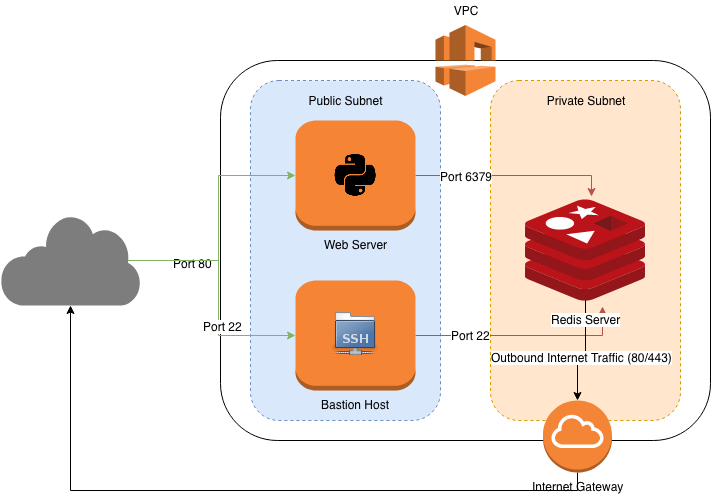

## AWS Elastic Compute Cloud (EC2)

>Using Amazon EC2 eliminates your need to invest in hardware up
 front, so you can develop and deploy applications faster.
  You can use Amazon EC2 to launch as many or as few virtual servers as you need, configure security and networking, and manage storage. Amazon EC2 enables you to scale up or down to handle changes in requirements or spikes in popularity,
 reducing your need to forecast traffic.


In this exercise, our target is to create an environment that looks like this:




##### Step 1:

* Open Terminal


##### Step 2:

*  **cd** into  ` /home/vagrant/Desktop/Labs/AWS-Security-Training/ec2/lab`

```commandline
cd  /home/vagrant/Desktop/Labs/AWS-Security-Training/ec2/lab
```
##### Step 3:

* Run `terraform apply`
* **Note:**
 
1. Once you enter it will ask you to enter `key name` give any name you like, using same key we can ssh into the ec2 server.

2. Once you press enter it will ask you a permission to do the action like `Do you want to perform these actions?`
then type `yes` and press `enter` it will continues the rest of the actions.

```commandline
terraform apply

var.key_name
  Enter a value:ucsf_ec2_instance

An execution plan has been generated and is shown below.
Resource actions are indicated with the following symbols:
  + create

Terraform will perform the following actions:

  + aws_vpc.ucsf-vpc
      id:                               <computed>
      arn:                              <computed>
      assign_generated_ipv6_cidr_block: "false"
      cidr_block:                       "10.0.0.0/16"


Do you want to perform these actions?
  Terraform will perform the actions described above.
  Only 'yes' will be accepted to approve.

  Enter a value: yes
  
  
aws_vpc.ucsf-vpc: Creating...
  arn:                              "" => "<computed>"

Apply complete! Resources: 1 added, 0 changed, 0 destroyed.
```

##### Step 4 :

* Open AWS console in the browser and check the created `EC2 ` Instance

##### Step 5 :
 
 * Run `terraform destroy` to remove the EC2 from the AWS.
 * **Note:** It will ask your permission to destroy the created EC2 from the AWS `Do you really want to destroy all resources?` then type 'yes' then press `enter
 to continue the process. 
  
 ```commandline
  
  Do you really want to destroy all resources?
  Terraform will destroy all your managed infrastructure, as shown above.
  There is no undo. Only 'yes' will be accepted to confirm.

  Enter a value: yes
  aws_flow_log.ucsf_aws_vpc_flow_log: Destroying... (ID: fl-0213b696e3b6c5c4e)
  aws_iam_role_policy.ucsf_vpc_flow_log_iam_policy: Destroying... (ID: ucsf_flowlogsRole:ucsf_flowlogsRolePolicy)
  aws_iam_role_policy.ucsf_vpc_flow_log_iam_policy: Destruction complete after 1s
  aws_flow_log.ucsf_aws_vpc_flow_log: Destruction complete after 4s
  aws_iam_role.vpc_flow_iam_role: Destroying... (ID: ucsf_flowlogsRole)
  aws_cloudwatch_log_group.vpc_flow_cloud_watch_group: Destroying... (ID: ucsf-aws-vpc-flow-log)
  aws_vpc.ucsf-vpc: Destroying... (ID: vpc-0abd67f8f4ffe1199)
  aws_cloudwatch_log_group.vpc_flow_cloud_watch_group: Destruction complete after 2s
  aws_vpc.ucsf-vpc: Destruction complete after 2s
  aws_iam_role.vpc_flow_iam_role: Destruction complete after 2s

  Destroy complete! Resources: 5 destroyed.
```
